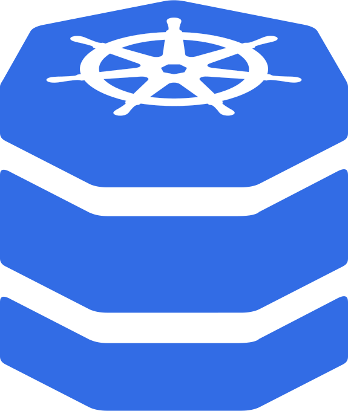

# KubeDB



[](https://github.com/clevyr/kubedb/actions/workflows/build.yml)

KubeDB is a command to interact with databases running in Kubernetes.
It supports dumping, restoring, and dropping into a database shell.
Optional flags are available to set running database parameters
(see each command's help entry for more details).
If no flags are given, KubeDB will inspect the pod configuration and attempt
to configure itself via the Kubernetes EnvVar API.

## Installation

### Homebrew (macOS, Linux)

<details>
  <summary>Click to expand</summary>

  ```shell
  brew install clevyr/tap/kubedb
  ```
</details>

### Docker

<details>
  <summary>Click to expand</summary>

KubeDB has a Docker image available at `ghcr.io/clevyr/kubedb`

```shell
docker pull ghcr.io/clevyr/kubedb
```

To use this image, you will need to volume bind a couple of directories into the Docker container:

1. **Kubeconfig:** Typically, this will be at `~/.kube/config`, and the container expects it to be at `/.kube/config`.
   - Example: `-v "$HOME/.kube/config:/.kube/config"`
2. **Data dir:** A directory to hold the generated dump or that has a sql file to restore. The container expects this to be at `/data`.
   - Example: `-v "$PWD:/data"`

#### Example:
```shell
docker run --rm -it -v "$HOME/.kube:/.kube" -v "$PWD:/data" ghcr.io/clevyr/kubedb dump
```
</details>

### APT Repository (Ubuntu, Debian)

<details>
  <summary>Click to expand</summary>

1. If you don't have it already, install the `ca-certificates` package
   ```shell
   sudo apt install ca-certificates
   ```

2. Add Clevyr's apt repository
   ```
   echo 'deb [trusted=yes] https://apt.clevyr.com /' | sudo tee /etc/apt/sources.list.d/clevyr.list
   ```

3. Update apt repositories
   ```shell
   sudo apt update
   ```

4. Install KubeDB
   ```shell
   sudo apt install kubedb
   ```
</details>

### RPM Repository (CentOS, RHEL)

<details>
  <summary>Click to expand</summary>

1. If you don't have it already, install the `ca-certificates` package
   ```shell
   sudo yum install ca-certificates
   ```

2. Add Clevyr's rpm repository to `/etc/yum.repos.d/clevyr.repo`
   ```ini
   [clevyr]
   name=Clevyr
   baseurl=https://rpm.clevyr.com
   enabled=1
   gpgcheck=0
   ```

3. Install KubeDB
   ```shell
   sudo yum install kubedb
   ```
</details>

KubeDB requires an existing Kubeconfig. See below for details.

## Usage

[View the generated docs for usage information.](docs/kubedb.md)

### Connecting to GKE

1. To connect to a Kubernetes cluster running in GKE,
   ensure you have the `gcloud` command installed. 
   If you have it then skip to step 2.  
   Otherwise, you can either [take a look at GCP's install doc](https://cloud.google.com/sdk/docs/install), 
   or run:

   ```shell
   brew install google-cloud-sdk
   gcloud init
   ```
2. Install the `gke-cloud-auth-plugin` per the GCP install doc or run:

    ```shell
    gcloud components install gke-gcloud-auth-plugin
    ```

3. Then to generate a Kubeconfig, run:

   ```shell
   gcloud container clusters get-credentials --project=PROJECT CLUSTER_NAME
   ```
   
4. If you don’t encounter any errors then you should be connected and ready to work with databases!
   To verify, type in the following command and press the tab key twice:

   ```shell
   kubedb exec -n <TAB><TAB>
   ```

   All of your current namespaces should show up in your shell.
   Many of the KubeDB flags support tab completion.
